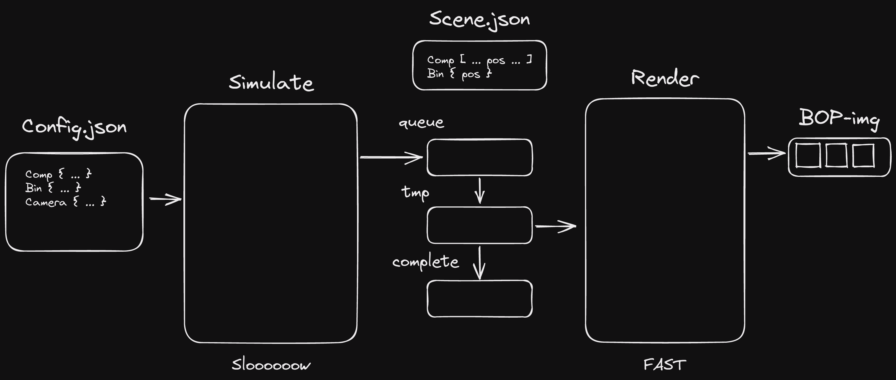

# Introduction

[](https://colab.research.google.com/github/hansaskov/BlenderBin/blob/master/examples/colab.ipynb)

Simulate many objects falling in a bin and create high detailed annotated images with the BlenderBin repository.

# Dependencies

To use the BlenderBin repository, a Linux-based operating system is required. The repository has been tested on Ubuntu 18.04 and 22.04. Additionally, CMake must be installed.

To begin, download the repository:

```bash
git clone -b blenderproc-source --recurse-submodules https://github.com/hansaskov/BlenderBin.git
cd ./BlenderBin
```

Next, install the necessary dependencies:

```bash
pip install -r requirements.txt
```

You have not install blenderproc, but we need some extra dependencies inside the blenderproc enviroment.

```bash
blenderproc pip install open3d dacite
```

To run the rendering with random background or a random texture download the haven collection. To run without a random backround enable the `--no-random-bg` flag.

```bash
blenderproc download haven resources/blenderproc/haven
```

Note that these commands may take some time to complete.

# Running the Render

First, start by simulating scenes in the render.

```bash
blenderproc run bin_simulator.py
```

In another console start the render

```bash
blenderproc run bin_render.py
```

When a scene has been simulated four imges are rendered of the scene. The scenes are also saved in a folder for easy reuse with other parameters. Check out the resources/simulations folder.

To adjust runtime settings, such as the number of components to simulate and the number of runs, you can use the following arguments:

```bash
blenderproc run bin_render.py \
--comp-amount-min 1 \
--comp-amount-max 10 \
--number-of-runs 10 \
```

To use your own objects, you will need a 3D model of a box or environment and a 3D model of your component, in either the .ply or .obj format. These changes must be made in the config.json file.

```json
{
  "comp": [
    {
      "name": "ape",
      "path": "./3d_models/comp/ape.obj",
      "random_color": true,
      "random_texture": false,
      "mm_2_m": true
    }
  ],

  "bins": [
    {
      "path": "./3d_models/bins/square_box.obj",
      "random_color": false,
      "random_texture": true,
      "mm_2_m": true,
      "dimensions": [176, 156, 100]
    }
  ],

  "camera": {
    "cx": 355.29037487506866,
    "cy": 290.31518501860995,
    "fx": 1778.1134033203125,
    "fy": 1778.0201424523975,
    "height": 540,
    "width": 720
  }
}
```

Do note that "random_texture" overrides the "random_color", as the random texture is higher priority.

# Program Architecture

We have split the render and simulator apart as it makes it easier to scale the simulation and rendering independently of each other. The flow of data can be described from the image below.

