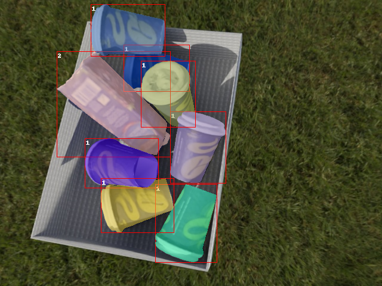

[](https://colab.research.google.com/github/hansaskov/BlenderBin/blob/master/examples/colab.ipynb)
# BlenderBin

Simulate objects falling in a bin and create your synthetic dataset with perfectly annotated images.
<p align="center">
  
</p>

# Installation

To use the BlenderBin repository, a Linux-based operating system is required. The repository has been tested on Ubuntu 18.04 and 22.04. Additionally, CMake must be installed.

To begin, download the repository:

```bash
git clone --recurse-submodules https://github.com/hansaskov/BlenderBin
cd ./BlenderBin
```

Next, install the necessary dependencies

```bash
pip install -e BlenderProc
```
Then we will inject extra dependencies to the BlenderProc environment
```bash
blenderproc pip install dacite open3d
```

To run the rendering with random background or a random texture please download the haven collection. To run without a random backround enable the `--no-random-bg` flag.

```bash
blenderproc download haven resources/haven
```

Note that the haven download may take some time to complete.

# Using BlenderBin

First, start by simulating scenes in the render.

```bash
blenderproc run bin_simulator.py
```

In another console start the render

```bash
blenderproc run bin_render.py
```

When a scene has been simulated four imges are rendered of the scene. The scenes are also saved in a folder for easy reuse with other parameters. Check out the `resources/simulations` folder.

To adjust runtime settings, such as the number of components to simulate and the number of runs, you can use the following arguments:

```bash
blenderproc run bin_simulator.py \
--comp-amount-min 1 \       
--comp-amount-max 10 \      
--runs 10 \
--walls                     
```

To use your own objects, you will need a 3D model of a box or environment and a 3D model of your component, in either the .ply or .obj format. These changes can be made in the config.json file or by providing your own config using the `--config` tag.

Components and bins with an object id of 0 will have annotations labels ignored

```json
    "components": [
        {
            "name" : "obj_000001",
            "path" : "./3d_models/bop/icbin/models/obj_000001.ply",
            "obj_id" : 1,
            "random_color" : false,
            "random_texture" : false,
            "mm_2_m" : true
        },
    ],

    "bins" :  [
        {
            "name" : "box_bin",
            "path" : "./3d_models/bins/boxbin.obj",
            "obj_id" : 0,   // Annotations are ignored for bin
            "random_color" : true, 
            "random_texture" : true,
            "mm_2_m": true,
            "dimensions": [
                420,
                300,
                100
            ]
        }
    ],

    "camera":  "..." 

```

Do note that "random_texture" overrides the "random_color", as the random texture is of higher priority.

# Program Architecture

We have split the render and simulator apart as it makes it easier to scale the simulation and rendering independently of each other. The flow of data can be described from the image below.

### Simulate
The simulator works by first downsampling the mesh of the components, then loading them in with the bin. For the physics simulation to work, both components and the bin have a convex decomposition performed to enable realistic simulation and interations within the bin. Now that the setup has been completed, the next steps are to run a loop of dropping components in the bin, saving their positions and repeating. Each simulations is stored in a folder under `resources/simulations/config_${name}/queue`. Which will be detected by the render

### Render
The rendering process checks for available simulations in the queue folders. If found, it uses the associated config file to load components and bin, then position them based on the previous simulated values. Random augmentation is applied to the scene like, lightning, surface appearance and camera position. The scene is then rendered with bbox, segmentation and deph annotations, ready to be used. 